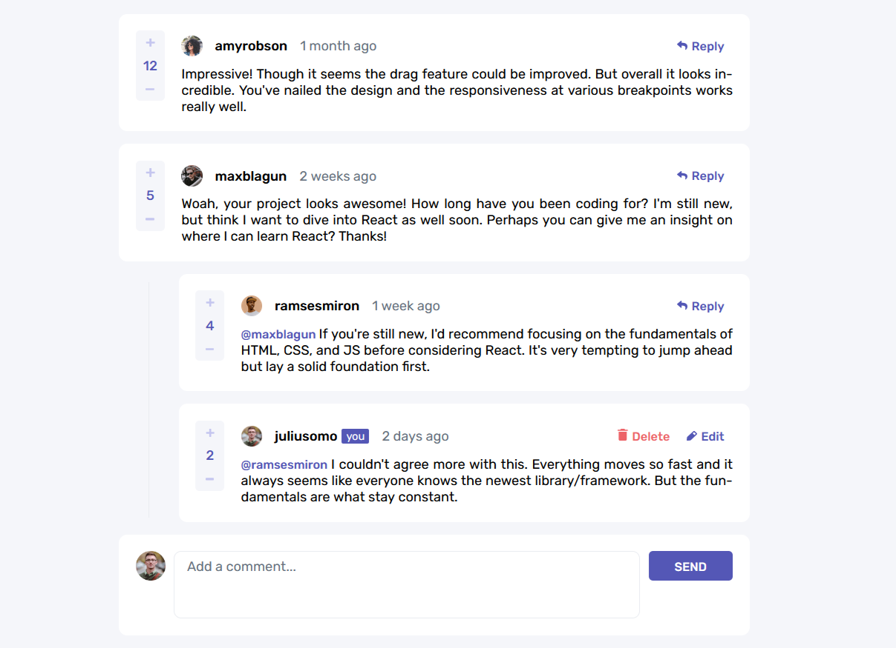
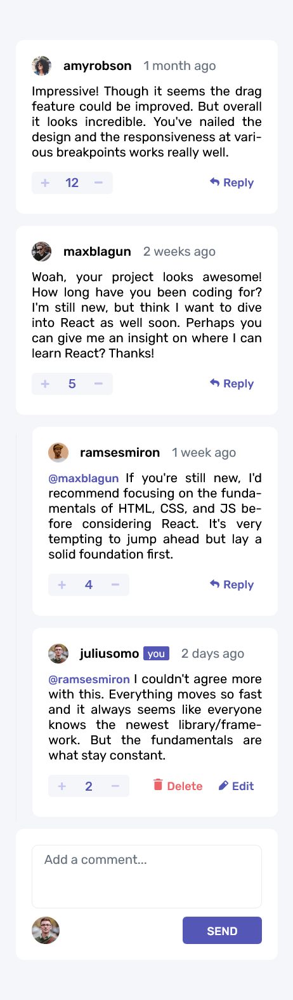

Live Site URL: [Add live site URL here](https://your-live-site-url.com)

# Frontend Mentor - Interactive comments section solution

This is a solution to the [Interactive comments section challenge on Frontend Mentor](https://www.frontendmentor.io/challenges/interactive-comments-section-iG1RugEG9). Frontend Mentor challenges help you improve your coding skills by building realistic projects.

## Overview

### The challenge

Users should be able to:

- View the optimal layout for the app depending on their device's screen size
- See hover states for all interactive elements on the page
- Create, Read, Update, and Delete comments and replies
- Upvote and downvote comments

Will be added:

- Uses `localStorage` to save the current state in the browser that persists when the browser is refreshed.
- Instead of using the `createdAt` strings from the `data.json` file, try using timestamps and dynamically track the time since the comment or reply was posted.

## My process

### Built with

- Semantic HTML5 markup
- CSS custom properties
- Flexbox
- CSS Grid

### What I learned

I better understood React philosophy. You don't modify the DOM directly. You modify the state and React changes the DOM for you. Coming from vanilla JS it was a little unintuitive, but it has many pros over the direct approach. I also learned how to use State, Effect and Ref hooks.

### Screenshots of my solution

